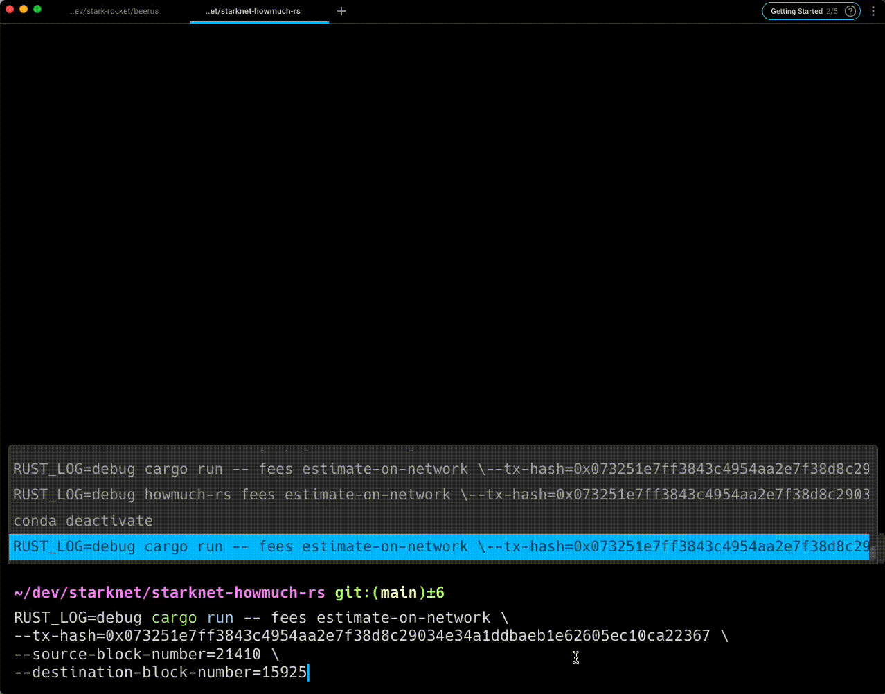

<div align="center">
  <h1>🐺 How Much ? 🦀</h1>
  
  <br />
</div>

<div align="center">
<br />


[](LICENSE)
[](https://github.com/abdelhamidbakhta/starknet-howmuch-rs/issues?q=is%3Aissue+is%3Aopen+label%3A%22help+wanted%22)

</div>



<details open="open">
<summary>Table of Contents</summary>

- [About](#about)
- [Getting Started](#getting-started)
  - [Prerequisites](#prerequisites)
  - [Installation](#installation)
- [Usage](#usage)
  - [Estimate fees on network](#estimate-fees-on-network)
- [Authors \& contributors](#authors--contributors)
- [Security](#security)
- [License](#license)

</details>

---

## About

> A library providing helpers for various StarkNet fees related tasks.
> It can be used as a library or as a CLI.

## Getting Started

### Prerequisites

- [Rust](https://www.rust-lang.org/tools/install)

### Installation

```bash
cargo install howmuch-rs
```

## Usage

```
How much ?

Usage: howmuch-rs <COMMAND>

Commands:
  fees  Fees related subcommands
  help  Print this message or the help of the given subcommand(s)

Options:
  -h, --help     Print help information
  -V, --version  Print version information
```

### Estimate fees on network

```bash
RUST_LOG=debug howmuch-rs fees estimate-on-network \
--tx-hash=0x073251e7ff3843c4954aa2e7f38d8c29034e34a1ddbaeb1e62605ec10ca22367 \
--source-block-number=21410 \
--destination-block-number=15925
```

## Authors & contributors

For a full list of all authors and contributors, see [the contributors page](https://github.com/abdelhamidbakhta/starknet-howmuch-rs/contributors).

## Security

StarkNet-HowMuch-rs follows good practices of security, but 100% security cannot be assured.
StarkNet-HowMuch-rs is provided **"as is"** without any **warranty**. Use at your own risk.


## License

This project is licensed under the **MIT license**.

See [LICENSE](LICENSE) for more information.
